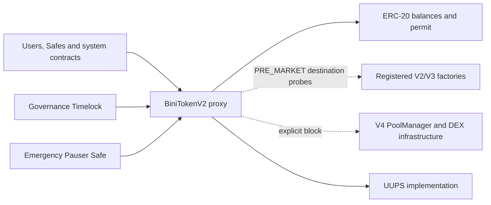
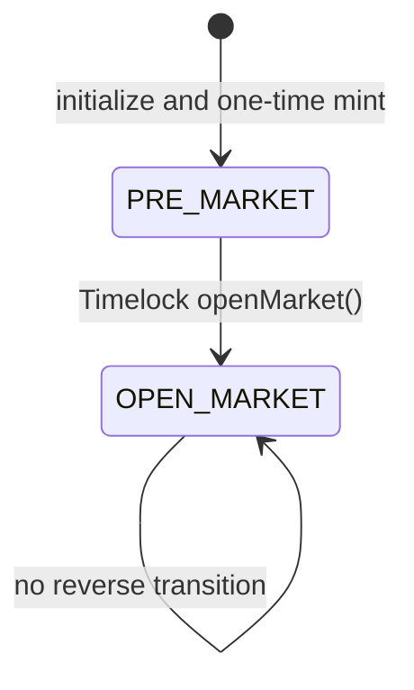
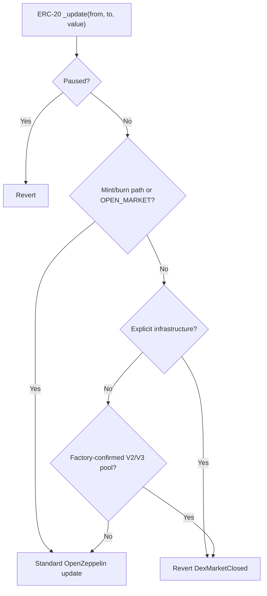

# System Architecture

## Scope

The token owns balances, standard ERC-20 approvals and permit, the one-way
market state, emergency pause and DEX destination policy. Vesting, migration,
bridge, staking, custody, rewards and liquidity custody are separate systems.

## Lifecycle

Pause is orthogonal to the market lifecycle. `pause()` stops transfers in both
states. `unpause()` does not change market state.

## Transfer Decision

Pool probes are capped at `30,000` gas each and copy only one 32-byte word.
Malformed, reverting, short-return and return-bomb contracts are treated as
unrecognized ordinary recipients unless explicitly registered.

## Authority

| Capability | Required holder |
| --- | --- |
| Default admin | Governance Timelock |
| Upgrade | Governance Timelock |
| Configure DEX policy | Governance Timelock, PRE_MARKET only |
| Open market | Governance Timelock, one-way |
| Pause | Emergency Pauser Safe |
| Unpause | Governance Timelock |
| Initial supply custody | Genesis Distribution Safe |

All three initializer addresses must already contain contract code. The default
admin additionally uses OpenZeppelin's delayed two-step transfer rules.

## Upgrade Boundary

The proxy follows ERC-1967 and the implementation follows UUPS/ERC-1822. BINI's
own state uses the ERC-7201 namespace `binibit.storage.BiniTokenV2`. UUPS is a
governance master capability: a future implementation can alter lifecycle
semantics, so upgrade review is part of the security boundary.
